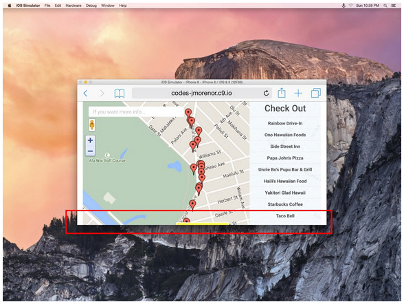

## Neighborhood Map project

### Notes to second submission based on reviewer's feedback of this project's initial submission

#### Interface Design

1. I tried to make the interface as responsive as I can. It is difficult to test on so many different browsers and devices. Browserstack looks like a great tool. If I continue to do front-end programming, I will purchase a subscription. In the meantime, I used the device mode in chrome's developer tools. I have no access to an iPhone (nor an Android box). However, it looks good on a Blackberry browser but it does not have all the functionality. I am not sure if it's due to coding or Blackberry's browser's compliance.

1. Google's Infowindow is intractable. Upon resizing the browser, infowindow does not behave well. I made a couple changes. I added a resize listener that includes a "minimization" of Infowindow to display only the venue name:
		google.maps.event.addDomListener(window, 'resize', function() {
		if (googleinfowin) googleinfowin.setContent('<strong>'+googname+'</strong>
click again for 4square');
		var center = map.getCenter();
		google.maps.event.trigger(map, "resize");
		map.setCenter(center);
		});
Also the resize event.trigger maintains the last clicked marker as the center.

1. I believe that input tag's mis-zooming upon focused may be fixed by changing the viewport metatag as the reviewer recommends.
		<meta name="viewport" content="width=device-width, initial-scale=1, maximum-scale=1, user-scalable=no">
However Google claims that the use of maximum-scale and user-scalable attributes "negatively impact(s) accessibility":
https://developers.google.com/speed/docs/insights/ConfigureViewport

1. I moved the list control on the same side as the search control to make the interface a little cleaner. I also kept the list of venues even for small screens. I used em font-sizing as reviewer recommends.

1. I could not replicate the error presented in the reviewer's screenshot below. The reviewer says that it is an overflow issue. But I am not sure how to debug it.

#### Error Handling

1. I tried to implement a graceful off-line error handling package using offline.js. I could see it in on a live server but not the localhost on a linux or mac python simplehttpserver or file:///. I was hoping it would reload the site when it reconnects but it does not. I am not sure how to test whether offline.js is checking AJAX requests since all my XHR occur onload time.

1. In addition to offline.js, I had to add another error check to make sure google maps can reload at launch time. I added the code below:
		if (typeof google === 'object' && typeof google.maps === 'object') {
			google.maps.event.addDomListener(window, 'load', initialize);
		} else {
			failedToLoad();
		}

#### Miscellaneous

1. I am aware of the CDN packages of JS libraries. Before this MVVM project, I was mostly offline while coding. I got dependent on bower packages especially during the optimization project.

1. The reviewer is right that the Foursquare API does not return consistent results -- whether I invoke it directly on a browser or invoking it programmatically. I spent many hours trying to figure out WHY. I finally gave up and hoped to get any data no matter how small.

1. I hope I did not break anything in the process of fixing things for this second submission. The last feedback was so thorough that it was a bit overwhelming. Almost 2 months doing front-end development, I will eventually think and code like a front-end developer, especially the documentation part.

### Separation of Concerns

1. Although separation of concerns has already been intimated in previous projects -- from styling separation in project 1, JSON models in project 2, pseudo-classical object-orientation in project 3, and even in the optimization project with DOM manipulation in JS code --, it's not until project 5 in which it was explicit that the view and the controller be separated as illustrated in Ben Jaffe's JavaScript Design Patterns course.

1. The task was to use knockout to illustrate the MVVM principle in that we had to bind variables in the view which was manipulated in the viewModel. My code starts with a Pin class which is basically the application's sole model which corresponds to google map markers in the view.

1. There are some functions that could have been encapsulated in the Pin class as it was required in the OOP project. However scoping issues came up when I attempted to use the pseudo-classical OOP structure with prototypal methods when using Knockout. I need to do more research to accomplish this.

1. Google Map's InfoWindow does not lend itself easily to styling. It is possible to style it. I prepared my code to do DOM manipulation in case it be required in the future to style InfoWindow more intricately.

### Functionality of the Neighborhood application

1. The application has the required components of a search bar, a list view and a Google map. The search bar has the feature to filter locations in the list view and the pin markers on the map. As user clicks on a pin marker or a venue name on the list, a Google InfoWindow pops up with Google and Foursquare data.

1. As the user loads the application, the Google markers are loaded both statically and dynamically. I initially coded the app with Google Map's Nearby Search (https://developers.google.com/maps/documentation/javascript/places#place_search_requests). I eventually discovered that the latitude and longitude do not match with those of Foursquare's. I used the code with Nearby Search to extract the latitude and longitude of venues in my vicinity. I then stored the location data in an array along with Foursquare venue IDs.

1. The Foursquare data is fetched using async requests to its venues/VENUE_ID API (https://developer.foursquare.com/docs/venues/venues). It is a no-nonsense straightforward API that only required an oauth_token. I used jQuery's getJSON method and a callback method so that while Foursquare data are being fetched asynchronously, the code can continue to execute.

1. There is one Reset control that recenters the map to my vicinity, clears the search bar, and places all the pin markers back to the original positions.

### Code base

#### This code used 3 sources for its basis

1. Pin class from http://stackoverflow.com/questions/29557938/removing-map-pin-with-search
1. Google map code from my Udacity Project 2 resume project.
1. Google's code at https://developers.google.com/maps/documentation/javascript/examples/control-custom

### Heavily Used Resources

* <a href="https://github.com/udacity/fend-office-hours/tree/master/Javascript%20Design%20Patterns">Udacity's Javascript Design Patterns documentation</a>
* <a href="https://developers.google.com/maps/documentation/javascript/">Google Maps JavaScript API</a>
* <a href="http://knockoutjs.com/documentation/introduction.html">Knockout JS Documentation</a>
* <a href="https://developer.foursquare.com/docs/">Foursquare's API docs</a>
* <a href="https://github.com/knockout/knockout/wiki/asynchronous-dependent-observables">An explanation of Asynchronous calls with Knockout</a>
* <a href="http://api.jquery.com/category/ajax/">jQuery's AJAX documentation</a>
* <a href="http://stackoverflow.com">Innumerable resources from stackoverflow.com</a>
* Udacity's AJAX course, Ben Jaffe's Javascript Design Patterns, an office hour with Udacity coach John on June 24 2015, and an appointment with Udacity coach John on June 25 2015.
